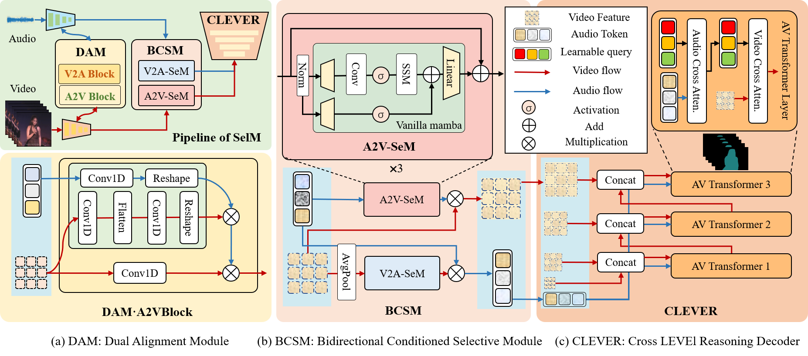

# SelM

<div align="center">

<h2>
SelM: Selective Mechanism based Audio-Visual Segmentation
</h2>

<h4>
<b>
Jiaxu Li<sup>†</sup>, Songsong Yu<sup>†</sup>, Yifan Wang*, Lijun Wang, Huchuan Lu
</b>
</h4>
</div>
This repository contains code for "SelM: Selective Mechanism based Audio-Visual Segmentation" (<b>ACM MM 2024 Oral, 3.97%</b>).


<b>IIAU Lab @ Dalian University of Technology<b>


## Overview



## Environment Prepare
Our Code was tested upon a conda environment. 

You can install conda by this link [Conda](https://docs.conda.io/en/latest/miniconda.html) and then create an environment as follows:
```
conda create -n selm python=3.9 

conda activate selm
```
We use Pytorch 2.0.1 with CUDA-11.7 as our default setting, install Pytorch by pip as below
```
pip install torch==2.0.1 torchvision==0.15.2 torchaudio==2.0.2
```
Notice : Mamba-ssm [Link](https://github.com/state-spaces/mamba) require CUDA 11.6+ , you might have to update your CUDA.

for other required packages:
```
pip install -r requirements.txt
```
## Dataset and Pretrained Backbone
For AVSBench Dataset ,please refer to this link [AVSBench](https://github.com/OpenNLPLab/AVSBench) to download the datasets

For Pretrained Backbone(ResNet50、PVT-v2、VGGish),please refer to this [link](https://drive.google.com/drive/folders/1386rcFHJ1QEQQMF6bV1rXJTzy8v26RTV?usp=sharing) to download.

You can place the dataset and pretrained backbone to the directory `data` `pretrained backbone`
Notice : Don't forget to change the paths of data and model in `config.py`

## Pretrained Model
You can download our pretrained SelM models by Google Drive and place it to the directory `pretrained model`

|Method|Subset|mIoU|F-score|Download|
|:---:|:---:|:---:|:---:|:---:|
|SelM-R50|S4|76.6|86.2|[pth](https://drive.google.com/file/d/1kJI00umTGOa05HxDdrHYVPozLn32cc_o/view?usp=sharing)|
|SelM-PVTv2|S4|83.5|91.2|[pth](https://drive.google.com/file/d/1WFcfB5cawzqLSxUJH7yP3xL2JN0ZX27V/view?usp=sharing)|
|SelM-R50|MS3|54.5|65.6|[pth](https://drive.google.com/file/d/19YHJOec_XbJpzAe2JJs6Omm71dmRZHNr/view?usp=sharing)|
|SelM-PVTv2|MS3|60.3|71.3|[pth](https://drive.google.com/file/d/1xtb7GRciK29RJMVHgZRhDSOhBJT-y93Y/view?usp=sharing)|
|SelM-R50|AVSS|31.9|37.2|[pth](https://drive.google.com/file/d/1qr2_JotdX1P0EUh7WUHsBkydyQezmd7R/view?usp=sharing)|
|SelM-PVTv2|AVSS|41.3|46.9|[pth](https://drive.google.com/file/d/1b5x7I2JJJLtuU8KPCFT1HOagiPjk2yZE/view?usp=sharing)|

## Train
For S4 and MS3 settings, we supply single-gpu train, run the command below  :
```
#S4
cd avs_s4
bash train.sh

#MS3
cd avs_ms3
bash train.sh
```
Note that for AVSS setting, we supply muti-gpu train, to train SelM on 8 GPUs run:
```
cd avss
bash train.sh
``` 
## Test
For test, remember to change the path of weights ,run:
```
#S4
cd avs_s4
bash test.sh

#MS3
cd avs_ms3
bash test.sh

#AVSS
cd avss
bash test.sh
```
## Acknowledgement
This repo is based on [AVSBench](https://github.com/OpenNLPLab/AVSBench),[RIS-DMMI](https://github.com/toggle1995/RIS-DMMI),[CGFormer](https://github.com/SooLab/CGFormer),many thanks to these wonderful works.
## Ciation

